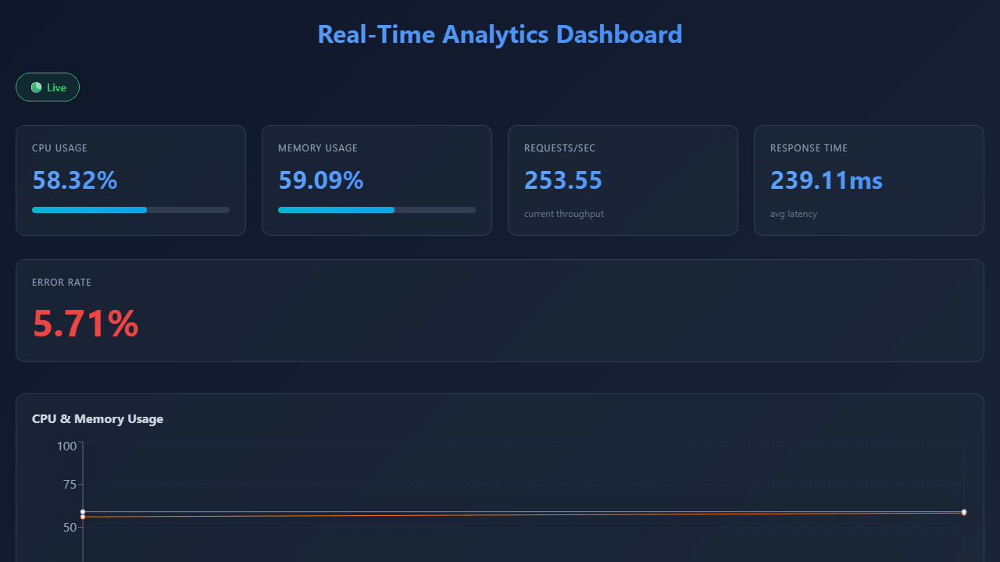
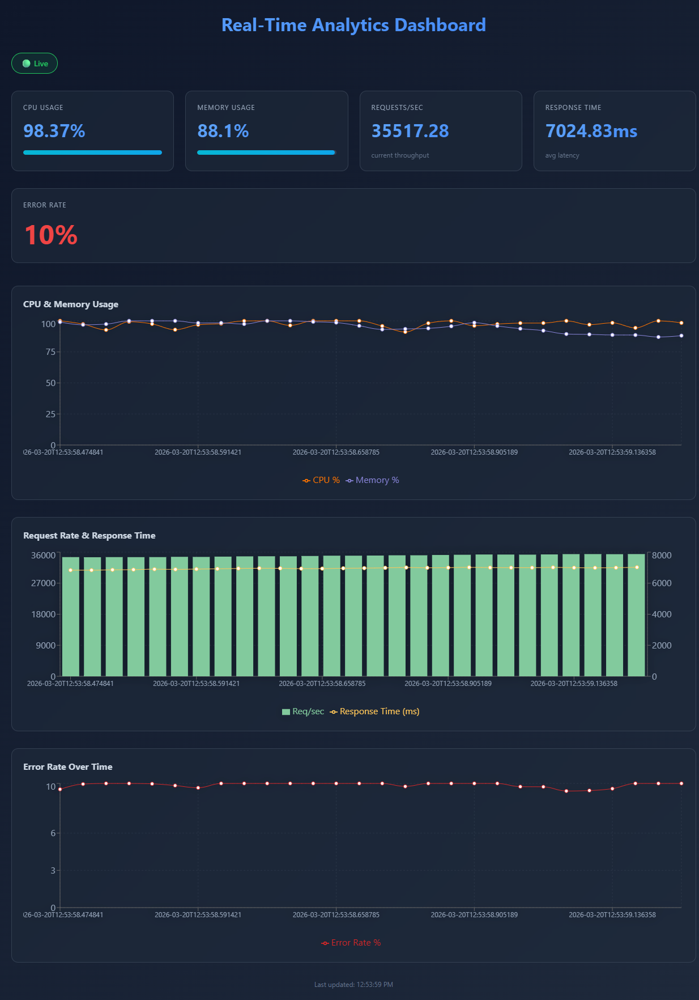

# Real-Time Analytics Dashboard

A high-performance real-time analytics dashboard built with FastAPI WebSockets and React. Stream live metrics from your servers and visualize system performance in real-time.

## Features

- ✅ **WebSocket Streaming** - Real-time updates via WebSockets
- ✅ **Live Metrics** - CPU, memory, throughput, response time, error rates
- ✅ **Beautiful Charts** - Recharts for stunning visualizations
- ✅ **Responsive Design** - Works on desktop and mobile
- ✅ **Auto-Reconnect** - Handles disconnections gracefully
- ✅ **Dark Theme** - Modern dark mode UI
- ✅ **60-Second History** - Automatic data retention

## Tech Stack

- **Backend**: FastAPI with WebSocket support
- **Frontend**: React + Vite + Recharts
- **Real-time**: WebSocket protocol

## Quick Start

### Backend

```bash
cd backend
python -m venv venv
source venv/bin/activate  # Windows: venv\Scripts\activate
pip install -r requirements.txt
uvicorn main:app --host 0.0.0.0 --port 8001 --reload
```

Backend runs on: http://localhost:8001
API Docs: http://localhost:8001/docs

### Frontend

```bash
cd frontend
npm install
npm run dev
```

Frontend runs on: http://localhost:3001

Visit: http://localhost:3001

## Dashboard Preview

### Live Demo (Animated)



### Static View



The dashboard displays real-time metrics with:

- **Live Status Indicator** - Shows connection status at the top
- **Key Metrics Cards** - CPU, Memory, Requests/sec, Response Time, Error Rate
- **CPU & Memory Chart** - Historical data visualization with 60-second history
- **Request Rate & Response Time Chart** - Dual-axis chart showing throughput and latency
- **Error Rate Chart** - Tracks error rates over time
- **Auto-Refresh** - Updates every second via WebSocket with smooth animations

## How It Works

1. **Backend generates metrics** every second with realistic fluctuations
2. **WebSocket broadcasts** metrics to all connected clients
3. **Frontend receives updates** and updates UI in real-time
4. **Charts update** with historical data for 60 seconds
5. **Auto-reconnect** if connection drops

## API

### REST Endpoints

```bash
# Get health status
GET /health

# Get latest metrics
GET /metrics
Response: {
  "timestamp": "2024-01-15T10:30:45.123456",
  "cpu_usage": 45.3,
  "memory_usage": 62.1,
  "requests_per_sec": 182.5,
  "response_time_ms": 215.3,
  "error_rate": 1.2
}
```

### WebSocket

```javascript
const ws = new WebSocket("ws://localhost:8001/ws");

ws.onmessage = (event) => {
  const data = JSON.parse(event.data);
  // data.type = 'metrics'
  // data.data = { metrics object }
};
```

## Metrics Explained

| Metric            | Description                      | Range  |
| ----------------- | -------------------------------- | ------ |
| **CPU Usage**     | System CPU utilization           | 0-100% |
| **Memory Usage**  | System memory utilization        | 0-100% |
| **Requests/sec**  | Throughput (requests per second) | 0-∞    |
| **Response Time** | Average latency in milliseconds  | 100+ms |
| **Error Rate**    | Percentage of failed requests    | 0-10%  |

## Project Structure

```
realtime-analytics-dashboard-app/
├── backend/
│   ├── main.py              # FastAPI app with WebSocket
│   ├── requirements.txt
│   └── Dockerfile (optional)
├── frontend/
│   ├── src/
│   │   ├── App.jsx          # Main React component
│   │   ├── App.css
│   │   ├── components/
│   │   │   └── MetricsChart.jsx  # Recharts component
│   │   └── main.jsx
│   ├── package.json
│   ├── vite.config.js
│   └── index.html
└── README.md
```

## Customization

### Change Metric Generation

Edit `backend/main.py` in the `MetricsGenerator` class:

```python
class MetricsGenerator:
    def generate_metrics(self):
        # Customize metric generation logic
        self.cpu_usage += random.uniform(-5, 8)
        # ... more metrics
```

### Connect to Real Metrics

Replace `MetricsGenerator` with real data sources:

```python
def generate_metrics(self):
    import psutil
    return {
        "cpu_usage": psutil.cpu_percent(),
        "memory_usage": psutil.virtual_memory().percent,
        # ... real metrics
    }
```

### Styling

Modify `frontend/src/App.css` to customize colors, layout, and responsiveness.

## Docker Deployment (Optional)

```bash
docker build -t analytics-dashboard ./backend
docker run -p 8001:8001 analytics-dashboard
```

## Performance Considerations

- **Update Interval**: 1 second (configurable in `App.jsx`)
- **History Size**: 60 data points (configurable)
- **WebSocket Buffer**: Optimized for 10+ concurrent connections
- **Memory Usage**: ~10MB per 1000 connected clients

## Troubleshooting

**WebSocket connection refused?**

- Ensure backend is running on port 8001
- Check CORS and WebSocket configuration

**Charts not updating?**

- Check browser console for WebSocket errors
- Verify Connection Manager is broadcasting to all clients

**Performance issues?**

- Reduce update frequency from 1s to 2s or higher
- Limit history size
- Check network latency

## Future Enhancements

- [ ] Database persistence (InfluxDB, Prometheus)
- [ ] Historical data queries
- [ ] Alerts on metric thresholds
- [ ] Multi-server monitoring
- [ ] Data export (CSV, JSON)
- [ ] Custom metric plugins

## License

MIT
